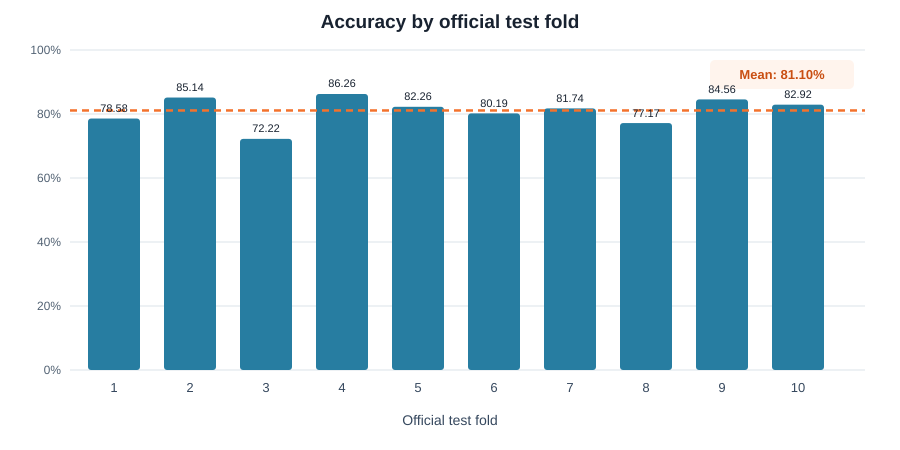

# Urban Sound Classification

[](https://github.com/dpiliasova/urban-sound-classification/actions/workflows/ci.yml)
[](https://www.python.org/)

Transfer learning for environmental sound classification on
[UrbanSound8K](https://urbansounddataset.weebly.com/urbansound8k.html). Audio
clips are converted to log-mel spectrograms and classified with a DenseNet121
backbone using the dataset's official, source-safe folds.

The project focuses on experimental validity as much as model quality:

- official folds are preserved to prevent source-recording leakage;
- architecture selection uses a fixed development split;
- final evaluation rotates test and validation folds across all ten folds;
- preprocessing is cached, reproducible, and independent of Kaggle paths;
- predictions and metrics are saved for later error analysis.

## Results

The coursework experiment recorded the following results:

| Evaluation | Accuracy |
|---|---:|
| Fixed dev split: folds 1–8 train, 9 validation, 10 test | **84.71%** |
| Official 10-fold evaluation | **81.10% ± 4.02%** |
| Best / weakest test fold | 86.26% / 72.22% |



The 10-fold result is retained as a **historical coursework result** rather than
presented as a rerun of the refactored package. During the portfolio audit, the
SpecAugment order was corrected: the original notebook inserted zero-valued
masks before per-example normalization, although zero is the maximum of a
decibel-scaled spectrogram. The package now normalizes first and then masks with
the normalized mean (`0`). A fresh GPU run is required before attaching the
historical score to the corrected implementation.

See [the experiment report](reports/model_analysis.md) for fold-level results,
class metrics, methodological decisions, and limitations.

## Modelling approach

1. Resample each clip to 22,050 Hz and pad or trim it to four seconds.
2. Compute a 128-bin log-mel spectrogram and cache it on disk.
3. Normalize each spectrogram, then apply time shift, Gaussian noise, and
   time/frequency masking to training examples.
4. Repeat the spectrogram across three channels for an ImageNet-pretrained
   DenseNet121.
5. Train the classifier head, unfreeze the backbone, and fine-tune with AdamW,
   Mixup, label smoothing, and early stopping.
6. Select checkpoints only on the validation fold and evaluate once on the test
   fold.

## Repository structure

```text
.
├── src/urban_sound/       # data, features, model, training, and evaluation
├── tests/                 # split, cache, augmentation, and metric tests
├── reports/               # recorded results and model analysis
├── configs/               # documented default experiment configuration
├── data/                  # local-only dataset and feature cache
└── pyproject.toml         # package and quality-tool configuration
```

## Data setup

Download UrbanSound8K from the
[official dataset page](https://urbansounddataset.weebly.com/urbansound8k.html)
and extract it locally:

```text
data/UrbanSound8K/
├── audio/
│   ├── fold1/
│   └── ...
└── metadata/
    └── UrbanSound8K.csv
```

The loader also recognizes the flattened Kaggle layout with `fold1/` and
`UrbanSound8K.csv` directly under the dataset root. Audio, cached features, and
model weights are intentionally excluded from Git.

## Installation

```bash
python -m venv .venv
source .venv/bin/activate
python -m pip install -e ".[dev]"
```

## Run an experiment

Train and evaluate on the fixed development split:

```bash
urban-sound train-dev --data-root data/UrbanSound8K --output-dir artifacts/dev
```

Run the final rotating-fold protocol after the configuration is fixed:

```bash
urban-sound cross-validate \
  --data-root data/UrbanSound8K \
  --output-dir artifacts/cv
```

For a quick pipeline check, limit each split:

```bash
urban-sound train-dev \
  --data-root data/UrbanSound8K \
  --output-dir artifacts/smoke \
  --max-samples-per-split 64 \
  --head-epochs 1 \
  --finetune-epochs 1
```

Run code quality checks:

```bash
python -m ruff check .
python -m pytest -q
```

## Key findings

- Performance varies materially between official folds, confirming that a
  single random split would be an incomplete evaluation.
- On the fixed test fold, `children_playing` and `jackhammer` have high recall
  but lower precision, while `dog_bark` and `drilling` are among the lower-recall
  classes.
- Transfer learning and two-stage fine-tuning produced the largest observed
  improvement; Mixup and time/frequency masking reduced overfitting in the
  coursework experiments.

## Limitations

- the corrected preprocessing pipeline still needs a full GPU rerun;
- only one random seed was recorded for the historical experiment;
- ImageNet features are transferred from images rather than learned from audio;
- spectrograms are repeated across RGB channels instead of using an audio-native
  pretrained backbone;
- the project evaluates offline classification and does not claim streaming
  latency or robustness to recording-device shift.

## Citation

UrbanSound8K was introduced in:

> Salamon, J., Jacoby, C., & Bello, J. P. (2014). A Dataset and Taxonomy for
> Urban Sound Research. *Proceedings of the 22nd ACM International Conference on
> Multimedia*.

## Author

**Daria Piliasova** — Economics and Data Analysis student at HSE University,
interested in feature engineering, model improvement, and interpretable machine
learning.
